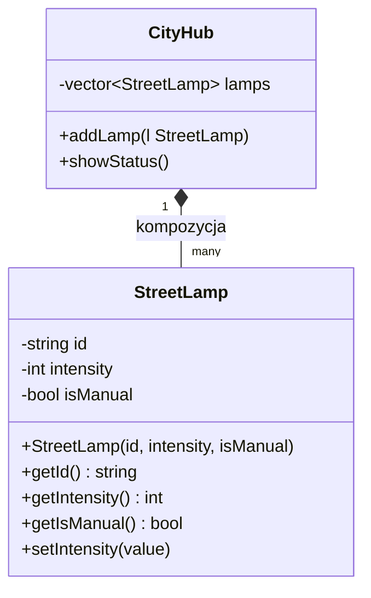

# cpp-oop-street-lamp-lab-2

Projekt referencyjny dla LAB 02 – Smart City IoT (domena StreetLamp). Poziomy: Basic & Stretch.

---

## Struktura projektu

```
.
├── include/          # Pliki nagłówkowe (.hpp)
│   ├── StreetLamp.hpp
│   └── CityHub.hpp
├── src/              # Pliki źródłowe (.cpp)
│   ├── StreetLamp.cpp
│   ├── CityHub.cpp
│   └── main.cpp
├── obj/              # Skompilowane pliki obiektowe (generowane)
├── bin/              # Plik wykonywalny (generowany)
├── Makefile
└── README.md
```

---

## Diagram klas



---

## Kompilacja i uruchomienie

```bash
make build   # kompiluje projekt
make run     # kompiluje (jeśli potrzeba) i uruchamia
make clean   # usuwa obj/ i bin/
```

---

## UWAGA DLA STUDENTÓW

**Makefile automatycznie wykrywa wszystkie pliki `.cpp` w folderze `src/`.**

Dzięki użyciu dyrektywy `wildcard`:

```makefile
SRCS := $(wildcard $(SRC_DIR)/*.cpp)
```

dodanie nowej klasy do projektu (np. `src/TrafficLight.cpp`) **nie wymaga żadnej edycji Makefile** – nowy plik zostanie automatycznie wykryty i skompilowany przy kolejnym wywołaniu `make build`.

---

## Wymagania

- GCC 13+ (wymagane dla pełnej obsługi `std::format` z C++20)
- GNU Make
